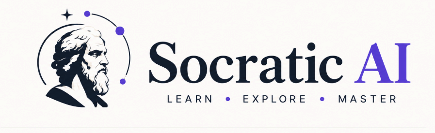
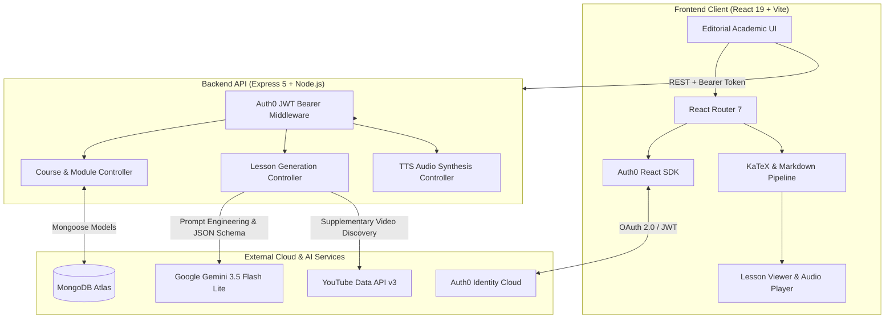
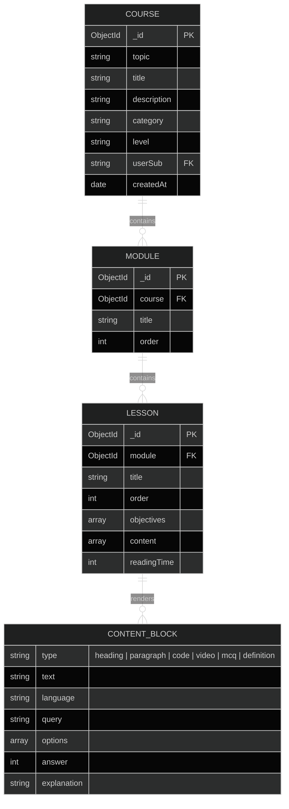

# Socratic AI — Autonomous Curriculum Engine & Deep Learning Platform

<div align="center">



**Question Everything. Learn Deeply.**

*A full-stack, AI-orchestrated educational platform that transforms any topic into a university-grade, structured curriculum with first-principles reasoning, native LaTeX mathematics, interactive code execution, and Socratic assessments.*

[](https://socratic-ai-wheat.vercel.app)
[](LICENSE)
[](https://react.dev)
[](https://nodejs.org)
[](https://mongodb.com)
[](https://ai.google.dev)
[](https://auth0.com)

</div>

---

## 📖 Overview

**Socratic AI** addresses a fundamental challenge in self-directed learning: *finding what to study is easy, but structuring a rigorous, progressive path from first principles is difficult.*

Generic AI chatbots generate unstructured, superficial walls of text without continuity, mathematical typesetting, or knowledge verification. **Socratic AI** bridges this gap by acting as an autonomous curriculum architect. Given any topic—from *Quantum Mechanics & Tensor Calculus* to *Distributed Consensus with Raft*—the platform designs a hierarchical, multi-module academic syllabus, synthesizes comprehensive lessons, discovers supplementary video lectures, and tests comprehension through interactive Socratic assessments.

---

## ⚡ Key Features

### 🎓 1. Autonomous Curriculum Architecture
- **Hierarchical Syllabus Generation**: Converts abstract subject queries into sequenced, multi-module courses with learning objectives and progressive difficulty.
- **First-Principles Pedagogy**: Lessons break down complex mechanisms into foundational axioms, historical motivation, formal mathematical proofs, and applied examples.

### 📐 2. Mathematical & Scientific Typography
- **Native LaTeX Rendering**: Seamless inline ($\lvert\psi\rvert^2$, $\nabla \times \mathbf{B}$) and block display equations powered by `KaTeX`, `remark-math`, and `rehype-katex`.
- **Heuristic Math Normalization**: Automatically captures and formats raw unescaped LaTeX symbols, greek letters, exponents, and matrix equations generated by LLMs.

### 💻 3. Interactive Code & Terminal Blocks
- **Syntax Highlighting**: Multi-language code rendering with `Prism.js` and custom academic dark themes.
- **Mobile-Responsive Code Controls**: Single-tap **Wrap / Scroll** toggle, line numbers, and one-click clipboard copying.

### 🎙️ 4. Audio Narration & Voice Learning
- **Conversational Hinglish Narration**: AI-powered Hinglish translation via Gemini, narrated through native browser speech synthesis.
- **Interactive Audio Controller**: Floating, non-intrusive audio player with play/pause, scrub, playback rate modulation, and auto-narration support.

### 🧠 5. Socratic Knowledge Checks (MCQ)
- **Active Recall Engine**: In-lesson multiple-choice questions with immediate explanatory feedback, correct/incorrect badges, and mathematical explanations.

### 📑 6. Publication-Grade PDF & Print Engine
- **Zero-Friction Notes Export**: Custom print stylesheets (`@media print`) strip navigation chrome, format margins to standard A4 specifications, and output clean textbook study notes.

### 🔒 7. Cloud Persistence & Identity
- **Auth0 Single Sign-On**: Secure OAuth 2.0 / OIDC authentication with JWT Bearer token verification.
- **Personal Course Library**: Searchable, filterable library tracking generated courses, modules, and completion state across devices.

---

## 🏗️ System Architecture



---

## 🛠️ Technology Stack

| Layer | Technologies | Purpose |
|---|---|---|
| **Frontend Core** | React 19, JavaScript (ES Modules), Vite 8 | Ultra-fast build toolchain and component framework |
| **Styling & Design** | Tailwind CSS v4, Vanilla CSS Custom Tokens | Editorial, high-contrast academic design system |
| **Math & Markdown** | KaTeX, `react-markdown`, `remark-math`, `rehype-katex`, `remark-gfm` | Publication-quality mathematical & scientific formatting |
| **Code Highlighting** | `react-syntax-highlighter` (Prism.js / Tomorrow theme) | Syntax highlighting with mobile line-wrap toggle |
| **Backend Core** | Node.js, Express.js 5 | Asynchronous RESTful microservice backend |
| **Database & ODM** | MongoDB, Mongoose 9 | Relational document database with indexed population |
| **Artificial Intelligence** | Google Gemini API (`@google/genai` / `gemini-3.5-flash-lite`) | Structured JSON course and lesson synthesis |
| **Video Discovery** | YouTube Data API v3, Axios | Contextual lecture discovery with responsive fallback frames |
| **Security & Auth** | Auth0, `express-oauth2-jwt-bearer` | Stateless RS256 JWT authorization & user identity |

---

## 📊 Data Models & Schema Design



---

## 🔌 API Reference

### Courses API

| Method | Endpoint | Auth | Description |
|---|---|---|---|
| `POST` | `/api/courses` | Optional / Guest | Generate new course curriculum outline from topic prompt |
| `GET` | `/api/courses/user-courses` | Required | Retrieve all saved courses for the authenticated user |
| `GET` | `/api/courses/:id` | Public | Fetch full course details, populated modules, and lesson list |
| `DELETE` | `/api/courses/:id` | Required | Delete course and cascade delete associated modules & lessons |

### Lessons & Content API

| Method | Endpoint | Auth | Description |
|---|---|---|---|
| `GET` | `/api/lessons/:id` | Public | Fetch full lesson content, markdown blocks, and MCQ checks |
| `POST` | `/api/lessons/generate` | Optional | Generate or regenerate structured lesson content on demand |
| `GET` | `/api/youtube/search` | Public | Fetch supplementary lecture video metadata from YouTube |

### System & Health

| Method | Endpoint | Auth | Description |
|---|---|---|---|
| `GET` | `/health` | Public | Uptime verification, database connection status, and model health |

---

## 🚀 Getting Started

### Prerequisites
- **Node.js** >= 18.x
- **npm** >= 9.x
- **MongoDB** instance (local or MongoDB Atlas)
- **Google Gemini API Key** ([Get one here](https://aistudio.google.com/))
- **Auth0 Account** ([Create free tier](https://auth0.com/))

---

### 1. Clone the Repository

```bash
git clone https://github.com/someshsinha/Socratic-AI.git
cd Socratic-AI
```

---

### 2. Backend Configuration & Setup

Navigate to the `server/` directory and install dependencies:

```bash
cd server
npm install
```

Create a `.env` file inside the `server/` directory:

```env
PORT=3000
MONGODB_URI=mongodb+srv://<username>:<password>@cluster.mongodb.net/socratic_ai?retryWrites=true&w=majority
GEMINI_API_KEY=your_gemini_api_key_here
YOUTUBE_API_KEY=your_youtube_api_key_here
AUTH0_ISSUER_BASE_URL=https://<your-tenant>.auth0.com/
AUTH0_AUDIENCE=http://localhost:3000
```

Start the backend development server:

```bash
npm run dev
# Server listening on http://localhost:3000
```

---

### 3. Frontend Configuration & Setup

Navigate to the `client/` directory and install dependencies:

```bash
cd ../client
npm install
```

Create a `.env` file inside the `client/` directory:

```env
VITE_API_URL=http://localhost:3000/api
VITE_AUTH0_DOMAIN=<your-tenant>.auth0.com
VITE_AUTH0_CLIENT_ID=<your-auth0-client-id>
VITE_AUTH0_AUDIENCE=http://localhost:3000
```

Start the frontend development server:

```bash
npm run dev
# Vite server running on http://localhost:5173
```

Visit **`http://localhost:5173`** in your browser to start generating curricula!

---

## 🧪 Engineering Standards & Reliability

Socratic-AI maintains a production-grade incident and bug resolution log in [**`ERROR_LOG.md`**](ERROR_LOG.md). 

Key engineering resolutions include:
- **Stateless Post-Login Navigation**: Decoupled Auth0 authentication from React Router to prevent circular dependency lockups and preserve deep-linked user destinations.
- **Zero Layout Shift (CLS)**: Strict 16:9 aspect-ratio framing for third-party YouTube embeds with branded academic fallbacks during quota limits.
- **Scroll-Boundary Preservation**: Elimination of root-level CSS overflow traps to ensure reliable `position: sticky` navigation.
- **Universal LaTeX Normalization**: Regex-driven KaTeX parsing to handle unstructured markdown math outputs without breaking client hydration.

---

## 👤 Author & Creator

<div align="center">

<a href="https://github.com/someshsinha">
  
</a>

<br/>

### **[Somesh Sinha](https://github.com/someshsinha)**

[](https://www.linkedin.com/in/somesh-sinha-a8614b284/)
[](https://github.com/someshsinha)
[](mailto:someshsinha902@gmail.com)

</div>

---

## 📄 License

This project is licensed under the **MIT License** — see the [LICENSE](LICENSE) file for details.
