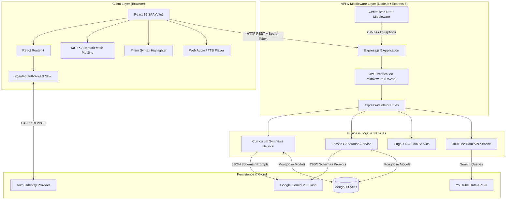
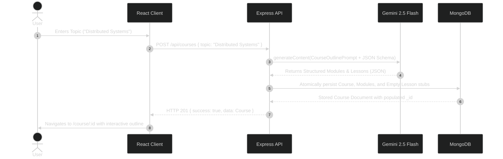
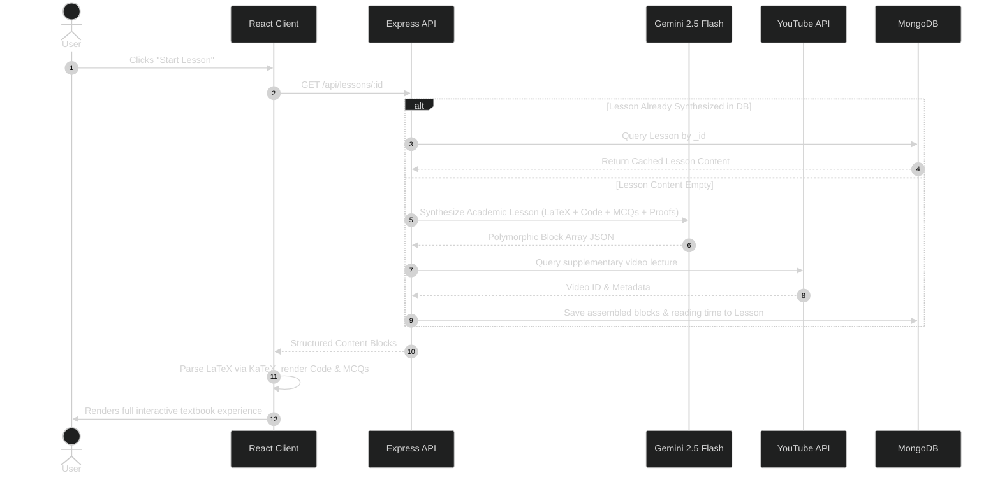
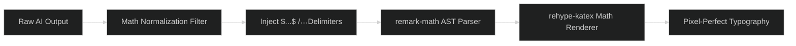

# Socratic AI — System Architecture & Engineering Deep-Dive

This document provides a comprehensive technical overview of **Socratic AI**, covering system design, data flow pipelines, prompt engineering specifications, mathematical typography rendering, and security models.

---

## 1. High-Level Architecture

Socratic AI is structured as a decoupled full-stack application consisting of an **Editorial Single-Page Application (SPA)** on the frontend and an **Asynchronous RESTful Microservice** on the backend, integrated with external LLM engines, identity providers, and media APIs.



---

## 2. Core Execution Pipelines

### 2.1. Curriculum Generation Pipeline
When a user submits a subject query (e.g. *"Distributed Systems"*):



---

### 2.2. On-Demand Lesson Synthesis & Multimodal Rendering

Lessons are generated and cached on-demand with first-principles structure:



---

## 3. Mathematical Typography Pipeline

Mathematical formulas in computer science and physics (quantum mechanics, algorithm complexity, linear algebra) require strict typography standards.

### The Problem
LLM outputs often alternate unpredictably between:
- Standard LaTeX blocks: `$$...$$`
- Inline markdown math: `$...$`
- Bare unescaped LaTeX symbols: `|\psi|^2`, `\frac{a}{b}`, `\hbar`, `\mathcal{O}(n \log n)`

### The Normalization Solution (`normalizeMath()`)
Socratic AI implements a multi-pass normalization pipeline prior to feeding content into `react-markdown`:



1. **Bare LaTeX Detection**: Detects common LaTeX operators (`\frac`, `\sqrt`, `\sum`, `\int`, Greek letters `\alpha-\omega`) lacking wrapping delimiters and wraps them in `$...$`.
2. **AST Parsing**: `remark-math` parses inline `$math$` and block `$$math$$` into mathematical nodes within the markdown abstract syntax tree.
3. **KaTeX Execution**: `rehype-katex` converts math AST nodes into high-performance KaTeX HTML/MathML rendering without layout shift.

---

## 4. Audio Narration & Voice Pedagogy

To accommodate auditory and multimodal learners, Socratic AI includes an AI-driven Text-to-Speech narration pipeline.

- **Content Summarization for Audio**: Raw markdown blocks (headers, code snippets, math formulas) are sanitized into clean, conversational prose suitable for speech synthesis.
- **Bilingual Capabilities**: Supports both clean standard English and localized Hinglish for conversational conceptual clarity.
- **Client-Side Media Controller**: A floating audio player (`NarrateButton.jsx`) provides full playback control (play, pause, scrub, speed modulation `0.75x - 2.0x`).

---

## 5. Security & Identity Architecture

Socratic AI enforces zero-trust stateless authorization using **Auth0** and standard OAuth 2.0 / OIDC specifications.


- **Algorithm**: RS256 Asymmetric Key Verification
- **JWKS Endpoint**: Automatically queries and caches public verification keys from Auth0 tenant
- **Audience Validation**: Enforces strict audience validation matching `http://localhost:3000` (or production API domain) to prevent token replay across different services.

---

## 6. Directory Structure & Module Organization

```text
Socratic-AI/
├── client/                     # Frontend Application (React 19 + Vite)
│   ├── public/                 # Static assets (favicons, logos)
│   ├── src/
│   │   ├── assets/             # Branding imagery & logos
│   │   ├── components/         # Reusable UI & Layout Components
│   │   │   ├── blocks/         # Polymorphic Lesson Content Renderers
│   │   │   │   ├── CodeBlock.jsx      # Prism highlighter with wrap controls
│   │   │   │   ├── HeadingBlock.jsx   # Section headers with anchor targets
│   │   │   │   ├── MCQBlock.jsx       # Interactive KaTeX-enabled quizzes
│   │   │   │   ├── ParagraphBlock.jsx # Markdown & Math paragraph renderer
│   │   │   │   └── VideoBlock.jsx     # Responsive 16:9 YouTube embed frame
│   │   │   ├── LessonRenderer.jsx     # Master polymorphic block dispatcher
│   │   │   ├── Navbar.jsx             # Sticky responsive navigation bar
│   │   │   └── NarrateButton.jsx      # Voice narration audio player
│   │   ├── config/             # Global site & creator configuration
│   │   ├── pages/              # Route Pages (Home, About, MyCourses, CourseDetail, LessonViewer)
│   │   ├── utils/              # API clients, auth constants, and math normalizers
│   │   ├── App.jsx             # App layout & post-login redirect controller
│   │   ├── index.css           # Global typography, tokens, and print stylesheets
│   │   └── main.jsx            # Auth0 & Router initialization root
│   └── vite.config.js          # Vite toolchain configuration (strict port 5173)
│
├── server/                     # Backend RESTful API (Express 5 + Node.js)
│   ├── config/                 # Database & environment configurations
│   ├── controllers/            # Route controllers (course, lesson, health, youtube)
│   ├── middlewares/            # Auth0 JWT verification, validation & error handling
│   ├── models/                 # Mongoose database schemas (Course, Module, Lesson)
│   ├── routes/                 # Express router definitions
│   ├── services/               # Gemini AI synthesis, Edge TTS & YouTube services
│   └── server.js               # Express application entry point
│
├── docs/                       # Comprehensive Architecture & API Documentation
│   ├── ARCHITECTURE.md         # Detailed architectural and design documentation
│   └── API.md                  # Complete REST API reference specification
├── ERROR_LOG.md                # Production error & incident resolution log
├── LICENSE                     # MIT Open Source License
└── README.md                   # Primary portfolio overview & setup guide
```
